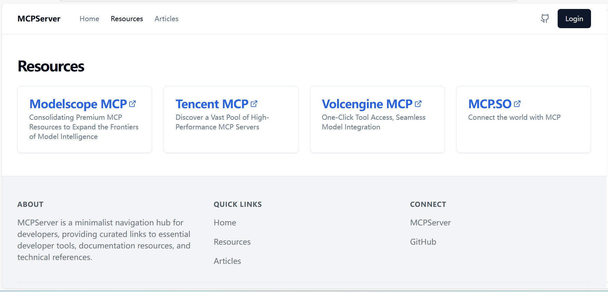

# MCPServer 导航站

[](https://github.com/chenrongjian/GitBase)


## 🌐 项目介绍

[MCPServer](https://mcp.nobugcode.com/) is a minimalist navigation hub for developers, providing curated links to essential developer tools, documentation resources, and technical references.



## 🌟 核心价值

- **精选资源**：拒绝冗余收录，每个条目都经过人工筛选验证
- **即时更新**：通过 GitHub API 实现零延迟内容同步
- **响应式设计**：完美适配桌面/平板/手机多端访问
- **无数据库架构**：创新性使用 GitHub 作为内容存储层
- **SEO优化**：自动生成符合搜索引擎规范的元数据

## 🛠️ 技术架构

| 层级       | 技术选型                  |
|------------|---------------------------|
| 框架       | [Next.js](https://nextjs.org/) |
| 样式系统   | [Tailwind CSS](https://tailwindcss.com/) |
| 组件库     | [Shadcn/UI](https://ui.shadcn.com/) |
| 数据管理   | GitHub API + JSON 存储    |
| 部署支持   | Vercel 一键部署           |

## 🚀 快速部署

[](https://vercel.com/new/clone?repository-url=https%3A%2F%2Fgithub.com%2Fchenrongjian%2FGitBase&project-name=MCPServer&repository-name=MCPServer)

## 📦 开发环境配置

```bash
# 克隆仓库
$ git clone https://github.com/chenrongjian/GitBase.git
$ cd GitBase

# 安装依赖
$ npm install

# 配置环境变量
$ cp .env.example .env.local
```

在 `.env.local` 中填写 GitHub 认证信息：
```env
GITHUB_TOKEN=your_personal_access_token
GITHUB_OWNER=chenrongjian
GITHUB_REPO=GitBase
ACCESS_PASSWORD=your_secure_password
```

## 🧩 内容管理

1. 登录管理后台 `/admin` 
2. 通过 `data/json/resources.json` 管理导航条目
3. 使用 Markdown 编写资源说明文档
4. 所有变更自动同步到 GitHub 仓库

## 📄 开源许可

本项目采用 [MIT License](https://github.com/chenrongjian/GitBase/blob/main/LICENSE)，可自由用于商业用途。


## 📢 反馈渠道

遇到问题请通过以下方式反馈：
- [GitHub Issues](https://github.com/chenrongjian/GitBase/issues)

## 🎉 感谢

本项目基于以下项目二次开发：
- [GitBase](https://github.com/qiayue/GitBase)